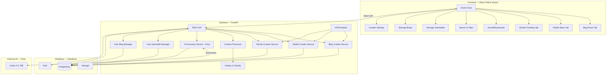

# 🤖 AI Content Crawler — Full Stack App

> **Goal**: Build a React Native app that aggregates AI company blog posts (with **per-user custom blog providers**), crawls Reddit for AI tool/app ideas (with **per-user custom subreddits**), tracks **GitHub trending repos**, and provides **AI-powered summaries on demand** — all in a beautiful, searchable feed.

---

## Tech Stack

| Layer | Technology | Why |
|-------|-----------|-----|
| **Frontend** | React Native (Expo) | Cross-platform, fast dev cycle |
| **Backend** | Python FastAPI | Async, fast, great for crawling |
| **Database** | Supabase (PostgreSQL) | Free tier: 500MB, REST API, Auth |
| **Crawling** | BeautifulSoup + PRAW + httpx | Blog scraping, Reddit API, GitHub API |
| **AI Summary** | Groq API (free Llama 3) | Free LLM inference, on-demand summaries |
| **Scheduler** | APScheduler | Periodic crawl jobs (no Celery overhead) |
| **Search** | PostgreSQL Full-Text Search | Free, built into Supabase |
| **Cache** | In-memory (FastAPI) | Simple, no Redis needed for MVP |

---

## Architecture Overview



---

## Database Schema

```sql
-- Sources: Default AI company blogs, default subreddits, GitHub search queries
CREATE TABLE sources (
    id UUID PRIMARY KEY DEFAULT gen_random_uuid(),
    name TEXT NOT NULL,                    -- "OpenAI Blog", "r/artificial"
    type TEXT NOT NULL CHECK (type IN ('blog', 'reddit', 'github')),
    url TEXT NOT NULL,                      -- RSS feed URL, subreddit, handle
    is_active BOOLEAN DEFAULT true,
    crawl_frequency_minutes INT DEFAULT 60,
    last_crawled_at TIMESTAMPTZ,
    created_at TIMESTAMPTZ DEFAULT now()
);

-- Crawled content items
CREATE TABLE posts (
    id UUID PRIMARY KEY DEFAULT gen_random_uuid(),
    source_id UUID REFERENCES sources(id),
    external_id TEXT,                      -- Reddit post ID, blog URL, GitHub repo ID
    title TEXT NOT NULL,
    content TEXT,                           -- Full text or summary
    url TEXT NOT NULL,
    author TEXT,
    thumbnail_url TEXT,
    published_at TIMESTAMPTZ,
    crawled_at TIMESTAMPTZ DEFAULT now(),
    
    -- Metadata
    category TEXT CHECK (category IN ('blog', 'tool', 'idea', 'news', 'tutorial', 'repo', 'other')),
    tags TEXT[],                            -- ['ai', 'llm', 'gpt', 'agent']
    sentiment TEXT CHECK (sentiment IN ('positive', 'neutral', 'negative')),
    relevance_score FLOAT DEFAULT 0,       -- AI-computed relevance 0-1
    
    -- AI Summary (on demand)
    ai_summary TEXT,                        -- Groq-generated summary, cached
    ai_summary_generated_at TIMESTAMPTZ,    -- When summary was generated
    
    -- GitHub-specific fields (NULL for non-GitHub posts)
    github_stars INT,
    github_forks INT,
    github_language TEXT,                   -- "Python", "TypeScript", etc.
    
    -- Engagement
    upvotes INT DEFAULT 0,
    comments_count INT DEFAULT 0,
    
    -- Search
    search_vector TSVECTOR,
    
    UNIQUE(external_id, source_id)
);

-- User bookmarks
CREATE TABLE bookmarks (
    id UUID PRIMARY KEY DEFAULT gen_random_uuid(),
    user_id UUID REFERENCES auth.users(id),
    post_id UUID REFERENCES posts(id),
    created_at TIMESTAMPTZ DEFAULT now(),
    UNIQUE(user_id, post_id)
);

-- 🆕 Per-user custom subreddits
CREATE TABLE user_subreddits (
    id UUID PRIMARY KEY DEFAULT gen_random_uuid(),
    user_id UUID REFERENCES auth.users(id) ON DELETE CASCADE,
    subreddit_name TEXT NOT NULL,           -- e.g., "webdev", "reactjs", "devops"
    is_active BOOLEAN DEFAULT true,
    added_at TIMESTAMPTZ DEFAULT now(),
    last_crawled_at TIMESTAMPTZ,
    UNIQUE(user_id, subreddit_name)
);

CREATE INDEX idx_user_subreddits_user ON user_subreddits(user_id);
CREATE INDEX idx_user_subreddits_active ON user_subreddits(is_active) WHERE is_active = true;

-- 🆕 Per-user custom blog providers
CREATE TABLE user_blogs (
    id UUID PRIMARY KEY DEFAULT gen_random_uuid(),
    user_id UUID REFERENCES auth.users(id) ON DELETE CASCADE,
    blog_name TEXT NOT NULL,                -- e.g., "TechCrunch AI", "My Favorite Blog"
    blog_url TEXT NOT NULL,                 -- RSS/Atom feed URL
    is_active BOOLEAN DEFAULT true,
    added_at TIMESTAMPTZ DEFAULT now(),
    last_crawled_at TIMESTAMPTZ,
    UNIQUE(user_id, blog_url)
);

CREATE INDEX idx_user_blogs_user ON user_blogs(user_id);
CREATE INDEX idx_user_blogs_active ON user_blogs(is_active) WHERE is_active = true;

-- 🆕 Dynamic Crawler Settings
CREATE TABLE crawler_settings (
    id UUID PRIMARY KEY DEFAULT gen_random_uuid(),
    crawler_name TEXT UNIQUE NOT NULL,      -- 'blog_global', 'blog_user', 'reddit_global', 'reddit_user', 'github_trending'
    interval_minutes INTEGER NOT NULL,
    is_active BOOLEAN DEFAULT true,
    updated_at TIMESTAMPTZ DEFAULT now()
);

-- Seed default settings
INSERT INTO crawler_settings (crawler_name, interval_minutes) VALUES
('blog_global', 60),
('blog_user', 90),
('reddit_global', 30),
('reddit_user', 45),
('github_trending', 180);

-- Full-text search index
CREATE INDEX idx_posts_search ON posts USING GIN(search_vector);
CREATE INDEX idx_posts_category ON posts(category);
CREATE INDEX idx_posts_published ON posts(published_at DESC);

-- Auto-update search vector
CREATE OR REPLACE FUNCTION update_search_vector()
RETURNS TRIGGER AS $$
BEGIN
    NEW.search_vector := to_tsvector('english', 
        coalesce(NEW.title, '') || ' ' || 
        coalesce(NEW.content, '') || ' ' ||
        coalesce(array_to_string(NEW.tags, ' '), '')
    );
    RETURN NEW;
END;
$$ LANGUAGE plpgsql;

CREATE TRIGGER posts_search_update
    BEFORE INSERT OR UPDATE ON posts
    FOR EACH ROW EXECUTE FUNCTION update_search_vector();
```

---

## Backend — FastAPI Project Structure

```
backend/
├── app/
│   ├── __init__.py
│   ├── main.py                  # FastAPI app entry point
│   ├── config.py                # Environment variables & settings
│   ├── database.py              # Supabase client setup
│   │
│   ├── api/
│   │   ├── __init__.py
│   │   ├── routes/
│   │   │   ├── posts.py         # GET /posts, GET /posts/{id}
│   │   │   ├── sources.py       # CRUD for crawl sources
│   │   │   ├── bookmarks.py     # User bookmark endpoints
│   │   │   ├── search.py        # Full-text search endpoint
│   │   │   ├── crawl.py         # Manual trigger crawl
│   │   │   ├── summary.py      # AI summary on demand
│   │   │   ├── user_subreddits.py # 🆕 Per-user subreddit CRUD
│   │   │   ├── user_blogs.py     # 🆕 Per-user blog provider CRUD
│   │   │   └── settings.py       # 🆕 Crawler settings API
│   │   └── deps.py              # Dependency injection
│   │
│   ├── crawlers/
│   │   ├── __init__.py
│   │   ├── base.py              # Abstract crawler class
│   │   ├── blog_crawler.py      # RSS + BeautifulSoup scraper (global + user blogs)
│   │   ├── reddit_crawler.py    # PRAW-based Reddit crawler (global + user subs)
│   │   ├── github_crawler.py    # GitHub trending repos crawler
│   │   └── processor.py         # Content classification & dedup
│   │
│   ├── scheduler/
│   │   ├── __init__.py
│   │   └── jobs.py              # APScheduler crawl job definitions
│   │
│   ├── models/
│   │   ├── __init__.py
│   │   ├── post.py              # Pydantic models for posts
│   │   ├── source.py            # Pydantic models for sources
│   │   ├── bookmark.py          # Pydantic models for bookmarks
│   │   ├── user_subreddit.py    # 🆕 Pydantic models for user subs
│   │   └── user_blog.py         # 🆕 Pydantic models for user blogs
│   │
│   ├── services/
│   │   ├── __init__.py
│   │   └── ai_summary.py        # Groq LLM summarization service
│   │
│   └── utils/
│       ├── __init__.py
│       ├── text_cleaner.py      # HTML stripping, text normalization
│       └── ai_tagger.py         # Keyword extraction & categorization
│
├── requirements.txt
├── .env.example
└── Dockerfile
```

### Key API Endpoints

```
GET    /api/v1/posts                    # Paginated feed (filter by type, category, tags)
GET    /api/v1/posts/{id}               # Single post detail
GET    /api/v1/posts/trending           # Top posts by relevance + engagement
GET    /api/v1/search?q=langchain       # Full-text search
POST   /api/v1/bookmarks               # Save a post
GET    /api/v1/bookmarks               # User's saved posts
DELETE /api/v1/bookmarks/{id}           # Remove bookmark
GET    /api/v1/sources                  # List all crawl sources
POST   /api/v1/sources                  # Add new source
POST   /api/v1/crawl/trigger            # Manually trigger a crawl
GET    /api/v1/stats                    # Dashboard stats
POST   /api/v1/posts/{id}/summarize     # Generate AI summary on demand
GET    /api/v1/github/trending           # Get trending GitHub repos (cached)

# 🆕 Per-User Custom Subreddits
GET    /api/v1/me/subreddits             # List user's custom subreddits
POST   /api/v1/me/subreddits             # Add a subreddit (e.g., {"name": "webdev"})
DELETE /api/v1/me/subreddits/{id}        # Remove a custom subreddit
PATCH  /api/v1/me/subreddits/{id}        # Toggle active/inactive
GET    /api/v1/me/feed                   # Personalized feed (global + user subs)
GET    /api/v1/subreddits/popular        # Suggested popular subreddits to add

# 🆕 Per-User Custom Blog Providers
GET    /api/v1/me/blogs                  # List user's custom blog feeds
POST   /api/v1/me/blogs                  # Add a blog (e.g., {"name": "...", "url": "..."})
DELETE /api/v1/me/blogs/{id}             # Remove a custom blog
PATCH  /api/v1/me/blogs/{id}             # Toggle active/inactive
GET    /api/v1/blogs/popular             # Suggested popular blog feeds to add

# 🆕 Crawler Settings
GET    /api/v1/settings/crawlers         # List all crawler schedules
PATCH  /api/v1/settings/crawlers/{name}  # Update interval_minutes or is_active
```

---

## Crawler Details

### 1. Blog Crawler — RSS + BeautifulSoup (Global + Per-User Blogs)

**Default Global AI Company Blogs** (pre-seeded, all users see these):

| Company | RSS/Blog URL |
|---------|-------------|
| OpenAI | `https://openai.com/blog/rss.xml` |
| Anthropic | `https://www.anthropic.com/blog/rss` |
| Google DeepMind | `https://deepmind.google/blog/rss.xml` |
| Meta AI | `https://ai.meta.com/blog/rss/` |
| Hugging Face | `https://huggingface.co/blog/feed.xml` |
| Stability AI | `https://stability.ai/blog/rss` |
| Mistral AI | `https://mistral.ai/news/rss.xml` |
| Cohere | `https://cohere.com/blog/rss` |
| AI21 Labs | `https://www.ai21.com/blog/rss` |
| Perplexity | `https://www.perplexity.ai/hub/blog/rss` |

**Per-User Custom Blog Providers** (each user can add their own RSS feeds):
- Users add blog RSS/Atom URLs from the **Manage Blogs** screen
- User blogs are crawled alongside global blogs
- Posts from user blogs appear in that user's personalized feed
- Suggested popular blog feeds (see below)

**Suggested Blog Feeds**:
| Blog | RSS URL |
|------|--------|
| TechCrunch AI | `https://techcrunch.com/category/artificial-intelligence/feed/` |
| The Verge AI | `https://www.theverge.com/rss/ai-artificial-intelligence/index.xml` |
| Hacker News (Best) | `https://hnrss.org/best?q=ai+llm+ml` |
| MIT Technology Review AI | `https://www.technologyreview.com/feed/` |
| Towards Data Science | `https://towardsdatascience.com/feed` |
| Simon Willison's Blog | `https://simonwillison.net/atom/everything/` |
| Lil'Log (Lilian Weng) | `https://lilianweng.github.io/index.xml` |
| Jay Alammar | `https://jalammar.github.io/feed.xml` |
| Chip Huyen | `https://huyenchip.com/feed.xml` |
| AI Snake Oil | `https://www.aisnakeoil.com/feed` |

```python
# blog_crawler.py — Core Logic (Global + Per-User)
import feedparser
import httpx
from bs4 import BeautifulSoup
from app.database import supabase

class BlogCrawler:
    async def crawl_global(self, source):
        """Crawl default global blog sources (shared across all users)"""
        await self._crawl_feed(
            feed_url=source.url,
            source_id=source.id,
            source_name=source.name
        )
    
    async def crawl_user_blogs(self):
        """Crawl all active user-added blog feeds"""
        # Get all unique active user blogs
        result = supabase.table("user_blogs") \
            .select("blog_name, blog_url") \
            .eq("is_active", True) \
            .execute()
        
        # Deduplicate blog URLs across users
        unique_blogs = {}
        for row in result.data:
            unique_blogs[row["blog_url"]] = row["blog_name"]
        
        for blog_url, blog_name in unique_blogs.items():
            source_id = await self._get_or_create_source(blog_name, blog_url)
            await self._crawl_feed(
                feed_url=blog_url,
                source_id=source_id,
                source_name=blog_name
            )
        
        # Update last_crawled_at for all user blogs
        supabase.table("user_blogs") \
            .update({"last_crawled_at": datetime.utcnow().isoformat()}) \
            .eq("is_active", True) \
            .execute()
    
    async def _crawl_feed(self, feed_url: str, source_id: str, source_name: str):
        """Crawl a single RSS/Atom feed"""
        feed = feedparser.parse(feed_url)
        for entry in feed.entries:
            content = self._extract_content(entry)
            if not await self.is_duplicate(entry.link):
                await self.save_post(
                    title=entry.title,
                    content=content,
                    url=entry.link,
                    author=entry.get('author', source_name),
                    published_at=entry.get('published_parsed'),
                    source_id=source_id
                )
    
    async def _get_or_create_source(self, blog_name: str, blog_url: str) -> str:
        """Find existing source or create new one for user blog"""
        result = supabase.table("sources") \
            .select("id") \
            .eq("url", blog_url) \
            .eq("type", "blog") \
            .single() \
            .execute()
        
        if result.data:
            return result.data["id"]
        
        new_source = supabase.table("sources").insert({
            "name": blog_name,
            "type": "blog",
            "url": blog_url,
            "is_active": True,
            "crawl_frequency_minutes": 60
        }).execute()
        return new_source.data[0]["id"]
    
    def _extract_content(self, entry):
        """Extract and clean HTML content from RSS entry"""
        raw = entry.get('content', [{}])[0].get('value', '') or entry.get('summary', '')
        soup = BeautifulSoup(raw, 'html.parser')
        return soup.get_text(separator=' ', strip=True)[:5000]
```

```python
# api/routes/user_blogs.py — Per-User Blog Provider Management
from fastapi import APIRouter, HTTPException, Depends
from app.database import supabase
from app.api.deps import get_current_user
import feedparser

router = APIRouter(prefix="/api/v1/me/blogs", tags=["user-blogs"])

POPULAR_BLOG_SUGGESTIONS = [
    {"name": "TechCrunch AI", "url": "https://techcrunch.com/category/artificial-intelligence/feed/"},
    {"name": "The Verge AI", "url": "https://www.theverge.com/rss/ai-artificial-intelligence/index.xml"},
    {"name": "Hacker News (AI/ML)", "url": "https://hnrss.org/best?q=ai+llm+ml"},
    {"name": "MIT Tech Review", "url": "https://www.technologyreview.com/feed/"},
    {"name": "Towards Data Science", "url": "https://towardsdatascience.com/feed"},
    {"name": "Simon Willison", "url": "https://simonwillison.net/atom/everything/"},
    {"name": "Lil'Log (Lilian Weng)", "url": "https://lilianweng.github.io/index.xml"},
    {"name": "Jay Alammar", "url": "https://jalammar.github.io/feed.xml"},
    {"name": "Chip Huyen", "url": "https://huyenchip.com/feed.xml"},
    {"name": "AI Snake Oil", "url": "https://www.aisnakeoil.com/feed"},
]

@router.get("")
async def list_my_blogs(user=Depends(get_current_user)):
    """List all blog feeds the current user has added"""
    result = supabase.table("user_blogs") \
        .select("*") \
        .eq("user_id", user.id) \
        .order("added_at", desc=True) \
        .execute()
    return {"blogs": result.data, "count": len(result.data)}

@router.post("")
async def add_blog(body: dict, user=Depends(get_current_user)):
    """Add a custom blog RSS feed to the user's feed"""
    name = body.get("name", "").strip()
    url = body.get("url", "").strip()
    if not name or not url:
        raise HTTPException(400, "Blog name and RSS URL are required")
    
    # Validate the RSS feed is reachable
    feed = feedparser.parse(url)
    if feed.bozo and not feed.entries:
        raise HTTPException(400, f"Could not parse RSS feed at {url}")
    
    try:
        result = supabase.table("user_blogs").insert({
            "user_id": user.id,
            "blog_name": name,
            "blog_url": url,
            "is_active": True
        }).execute()
        return {"blog": result.data[0], "message": f"{name} added to your feed"}
    except Exception:
        raise HTTPException(409, f"This blog feed is already in your list")

@router.delete("/{blog_id}")
async def remove_blog(blog_id: str, user=Depends(get_current_user)):
    """Remove a blog from the user's feed"""
    supabase.table("user_blogs") \
        .delete() \
        .eq("id", blog_id) \
        .eq("user_id", user.id) \
        .execute()
    return {"message": "Blog removed"}

@router.patch("/{blog_id}")
async def toggle_blog(blog_id: str, body: dict, user=Depends(get_current_user)):
    """Toggle a blog feed active/inactive"""
    supabase.table("user_blogs") \
        .update({"is_active": body.get("is_active", True)}) \
        .eq("id", blog_id) \
        .eq("user_id", user.id) \
        .execute()
    return {"message": "Blog updated"}

@router.get("/popular", prefix="/api/v1/blogs")
async def get_popular_blog_suggestions():
    """Return suggested popular blog RSS feeds to add"""
    return {"suggestions": POPULAR_BLOG_SUGGESTIONS}
```

### 2. Reddit Crawler — PRAW (Global + Per-User Subreddits)

**Default Global Subreddits** (pre-seeded, all users see these):
- `r/artificial` — General AI discussion
- `r/MachineLearning` — ML research & tools
- `r/LocalLLaMA` — Open-source LLM tools
- `r/ChatGPT` — ChatGPT ecosystem
- `r/singularity` — AI trends & futures
- `r/ArtificialIntelligence` — AI news
- `r/SideProject` — App ideas with AI
- `r/startups` — AI startup ideas

**Per-User Custom Subreddits** (each user can add their own):
- Users add subreddits from the **Manage Subreddits** screen
- User subs are crawled alongside global subs
- Posts from user subs appear in that user's personalized feed
- Suggested popular subreddits: `r/webdev`, `r/reactjs`, `r/python`, `r/golang`, `r/devops`, `r/selfhosted`, `r/entrepreneur`, `r/indiehackers`

```python
# reddit_crawler.py — Core Logic (Global + Per-User)
import praw
from app.database import supabase

class RedditCrawler:
    def __init__(self):
        self.reddit = praw.Reddit(
            client_id=settings.REDDIT_CLIENT_ID,
            client_secret=settings.REDDIT_CLIENT_SECRET,
            user_agent="AICrawler/1.0"
        )
    
    async def crawl_global(self, source):
        """Crawl default global subreddits (shared across all users)"""
        await self._crawl_subreddit(
            subreddit_name=source.url,
            source_id=source.id,
            apply_relevance_filter=True
        )
    
    async def crawl_user_subreddits(self):
        """Crawl all active user-added subreddits"""
        # Get all unique active user subreddits
        result = supabase.table("user_subreddits") \
            .select("subreddit_name") \
            .eq("is_active", True) \
            .execute()
        
        # Deduplicate subreddit names across users
        unique_subs = set(row["subreddit_name"] for row in result.data)
        
        for sub_name in unique_subs:
            # Find or create a source entry for this subreddit
            source_id = await self._get_or_create_source(sub_name)
            await self._crawl_subreddit(
                subreddit_name=sub_name,
                source_id=source_id,
                apply_relevance_filter=False  # User explicitly chose this sub
            )
        
        # Update last_crawled_at for all user subs
        supabase.table("user_subreddits") \
            .update({"last_crawled_at": datetime.utcnow().isoformat()}) \
            .eq("is_active", True) \
            .execute()
    
    async def _crawl_subreddit(self, subreddit_name: str, source_id: str, 
                                apply_relevance_filter: bool = True):
        """Crawl a single subreddit"""
        subreddit = self.reddit.subreddit(subreddit_name)
        for post in subreddit.hot(limit=50):
            if not apply_relevance_filter or self._is_relevant(post):
                await self.save_post(
                    title=post.title,
                    content=post.selftext[:5000] if post.selftext else "",
                    url=f"https://reddit.com{post.permalink}",
                    author=str(post.author),
                    upvotes=post.score,
                    comments_count=post.num_comments,
                    published_at=datetime.fromtimestamp(post.created_utc),
                    source_id=source_id,
                    external_id=post.id
                )
    
    async def _get_or_create_source(self, subreddit_name: str) -> str:
        """Find existing source or create new one for user subreddit"""
        result = supabase.table("sources") \
            .select("id") \
            .eq("url", subreddit_name) \
            .eq("type", "reddit") \
            .single() \
            .execute()
        
        if result.data:
            return result.data["id"]
        
        # Create new source
        new_source = supabase.table("sources").insert({
            "name": f"r/{subreddit_name}",
            "type": "reddit",
            "url": subreddit_name,
            "is_active": True,
            "crawl_frequency_minutes": 30
        }).execute()
        return new_source.data[0]["id"]
    
    def _is_relevant(self, post):
        """Filter for AI-related content (only for global subs)"""
        keywords = ['ai', 'llm', 'gpt', 'agent', 'tool', 'app', 
                     'launch', 'built', 'released', 'open source',
                     'model', 'api', 'framework', 'startup']
        text = f"{post.title} {post.selftext}".lower()
        return any(kw in text for kw in keywords)
```

```python
# api/routes/user_subreddits.py — Per-User Subreddit Management
from fastapi import APIRouter, HTTPException, Depends
from app.database import supabase
from app.api.deps import get_current_user

router = APIRouter(prefix="/api/v1/me/subreddits", tags=["user-subreddits"])

POPULAR_SUGGESTIONS = [
    {"name": "webdev", "description": "Web development community"},
    {"name": "reactjs", "description": "React.js discussion"},
    {"name": "python", "description": "Python programming"},
    {"name": "golang", "description": "Go programming language"},
    {"name": "rust", "description": "Rust programming"},
    {"name": "devops", "description": "DevOps practices & tools"},
    {"name": "selfhosted", "description": "Self-hosted apps & services"},
    {"name": "entrepreneur", "description": "Entrepreneurship & startups"},
    {"name": "indiehackers", "description": "Indie makers & bootstrappers"},
    {"name": "node", "description": "Node.js community"},
    {"name": "FlutterDev", "description": "Flutter development"},
    {"name": "aws", "description": "Amazon Web Services"},
    {"name": "dataengineering", "description": "Data engineering"},
    {"name": "learnmachinelearning", "description": "Learning ML"},
]

@router.get("")
async def list_my_subreddits(user=Depends(get_current_user)):
    """List all subreddits the current user has added"""
    result = supabase.table("user_subreddits") \
        .select("*") \
        .eq("user_id", user.id) \
        .order("added_at", desc=True) \
        .execute()
    return {"subreddits": result.data, "count": len(result.data)}

@router.post("")
async def add_subreddit(body: dict, user=Depends(get_current_user)):
    """Add a custom subreddit to the user's feed"""
    name = body.get("name", "").strip().lower()
    if not name:
        raise HTTPException(400, "Subreddit name is required")
    
    # Validate subreddit exists on Reddit
    # (optional: call Reddit API to verify)
    
    try:
        result = supabase.table("user_subreddits").insert({
            "user_id": user.id,
            "subreddit_name": name,
            "is_active": True
        }).execute()
        return {"subreddit": result.data[0], "message": f"r/{name} added to your feed"}
    except Exception:
        raise HTTPException(409, f"r/{name} is already in your feed")

@router.delete("/{sub_id}")
async def remove_subreddit(sub_id: str, user=Depends(get_current_user)):
    """Remove a subreddit from the user's feed"""
    supabase.table("user_subreddits") \
        .delete() \
        .eq("id", sub_id) \
        .eq("user_id", user.id) \
        .execute()
    return {"message": "Subreddit removed"}

@router.patch("/{sub_id}")
async def toggle_subreddit(sub_id: str, body: dict, user=Depends(get_current_user)):
    """Toggle a subreddit active/inactive"""
    supabase.table("user_subreddits") \
        .update({"is_active": body.get("is_active", True)}) \
        .eq("id", sub_id) \
        .eq("user_id", user.id) \
        .execute()
    return {"message": "Subreddit updated"}

@router.get("/popular", prefix="/api/v1/subreddits")
async def get_popular_suggestions():
    """Return suggested popular subreddits to add"""
    return {"suggestions": POPULAR_SUGGESTIONS}
```

---

### 3. GitHub Trending Crawler — GitHub REST API

Uses the **GitHub Search API** (`/search/repositories`) to find recently created or rapidly-growing AI/ML repositories. No authentication required for basic use (60 req/hour), or use a free GitHub token for 5,000 req/hour.

**Search Queries** (pre-configured):

| Query | Description |
|-------|-------------|
| `ai tool` | General AI tools |
| `llm agent framework` | LLM agent frameworks |
| `machine learning` | ML projects |
| `gpt plugin` | GPT ecosystem |
| `ai automation` | AI automation tools |
| `langchain langgraph` | LangChain ecosystem |
| `vector database` | Vector DB projects |
| `open source llm` | Open-source LLMs |

```python
# github_crawler.py — Core Logic
import httpx
from datetime import datetime, timedelta

class GitHubCrawler:
    BASE_URL = "https://api.github.com"
    
    def __init__(self):
        self.headers = {
            "Accept": "application/vnd.github+json",
            "X-GitHub-Api-Version": "2022-11-28",
        }
        # Optional: Add token for higher rate limits
        if settings.GITHUB_TOKEN:
            self.headers["Authorization"] = f"Bearer {settings.GITHUB_TOKEN}"
    
    async def crawl_trending(self, query: str = "ai tool", days_back: int = 7):
        """Find trending repos created/updated in the last N days"""
        date_since = (datetime.utcnow() - timedelta(days=days_back)).strftime("%Y-%m-%d")
        
        async with httpx.AsyncClient() as client:
            response = await client.get(
                f"{self.BASE_URL}/search/repositories",
                headers=self.headers,
                params={
                    "q": f"{query} created:>{date_since}",
                    "sort": "stars",
                    "order": "desc",
                    "per_page": 30
                }
            )
            data = response.json()
        
        for repo in data.get("items", []):
            if repo["stargazers_count"] >= 10:  # Minimum star threshold
                await self.save_post(
                    title=f"{repo['full_name']} — {repo['description'] or 'No description'}",
                    content=self._build_repo_content(repo),
                    url=repo["html_url"],
                    author=repo["owner"]["login"],
                    thumbnail_url=repo["owner"]["avatar_url"],
                    published_at=repo["created_at"],
                    external_id=str(repo["id"]),
                    category="repo",
                    tags=self._extract_tags(repo),
                    github_stars=repo["stargazers_count"],
                    github_forks=repo["forks_count"],
                    github_language=repo.get("language"),
                )
    
    def _build_repo_content(self, repo: dict) -> str:
        """Build rich content string from repo metadata"""
        parts = [
            repo.get("description", ""),
            f"\n⭐ {repo['stargazers_count']} stars | 🍴 {repo['forks_count']} forks",
            f"📝 Language: {repo.get('language', 'N/A')}",
            f"📋 License: {repo.get('license', {}).get('name', 'N/A') if repo.get('license') else 'N/A'}",
            f"🔄 Last updated: {repo['updated_at'][:10]}",
        ]
        if repo.get("topics"):
            parts.append(f"🏷️ Topics: {', '.join(repo['topics'][:10])}")
        return "\n".join(parts)
    
    def _extract_tags(self, repo: dict) -> list:
        """Extract tags from repo topics + language"""
        tags = list(repo.get("topics", []))[:8]
        if repo.get("language"):
            tags.append(repo["language"].lower())
        return tags
```

---

### 4. AI Summary on Demand — Groq (Free Llama 3)

When a user taps the **✨ Summarize** button on any post, the backend calls the **Groq API** (free tier: 30 requests/minute, 14,400/day) to generate a concise summary. The result is **cached in the database** so subsequent requests are instant.

> [!TIP]
> **Why Groq?** Free tier with Llama 3.3 70B — fastest inference available. No credit card required. 6,000 tokens/min free.

**Groq Free Tier Limits**:
| Model | Requests/min | Requests/day | Tokens/min |
|-------|-------------|-------------|------------|
| Llama 3.3 70B | 30 | 14,400 | 6,000 |
| Llama 3.1 8B | 30 | 14,400 | 6,000 |

```python
# services/ai_summary.py — AI Summary Service
import httpx
from app.config import settings

class AISummaryService:
    GROQ_URL = "https://api.groq.com/openai/v1/chat/completions"
    
    SYSTEM_PROMPT = """You are an AI content summarizer for a tech news app. 
Generate a concise, insightful summary of the provided content.
Rules:
- 3-5 bullet points maximum
- Each bullet: 1 short sentence
- Focus on: what it is, why it matters, key takeaway
- Use emoji bullets (🔹 🔸 ⚡ 💡 🚀)
- If it's a GitHub repo: highlight what it does, tech stack, and why it's trending
- If it's a Reddit post: capture the core idea/discussion point
- If it's a blog: extract the key announcement or insight"""
    
    async def summarize(self, title: str, content: str, source_type: str) -> str:
        """Generate AI summary using Groq's free Llama 3.3 70B"""
        user_prompt = f"""Source: {source_type.upper()}
Title: {title}
Content: {content[:3000]}

Generate a concise summary:"""
        
        async with httpx.AsyncClient(timeout=30) as client:
            response = await client.post(
                self.GROQ_URL,
                headers={
                    "Authorization": f"Bearer {settings.GROQ_API_KEY}",
                    "Content-Type": "application/json"
                },
                json={
                    "model": "llama-3.3-70b-versatile",
                    "messages": [
                        {"role": "system", "content": self.SYSTEM_PROMPT},
                        {"role": "user", "content": user_prompt}
                    ],
                    "temperature": 0.3,
                    "max_tokens": 300,
                }
            )
            data = response.json()
            return data["choices"][0]["message"]["content"]
```

```python
# api/routes/summary.py — Summary Endpoint
from fastapi import APIRouter, HTTPException
from app.services.ai_summary import AISummaryService
from app.database import supabase
from datetime import datetime

router = APIRouter()
summary_service = AISummaryService()

@router.post("/api/v1/posts/{post_id}/summarize")
async def summarize_post(post_id: str):
    # 1. Fetch the post
    result = supabase.table("posts").select("*").eq("id", post_id).single().execute()
    post = result.data
    if not post:
        raise HTTPException(status_code=404, detail="Post not found")
    
    # 2. Return cached summary if available (< 24 hours old)
    if post.get("ai_summary") and post.get("ai_summary_generated_at"):
        generated_at = datetime.fromisoformat(post["ai_summary_generated_at"])
        if (datetime.utcnow() - generated_at).total_seconds() < 86400:  # 24h cache
            return {
                "post_id": post_id,
                "summary": post["ai_summary"],
                "cached": True,
                "generated_at": post["ai_summary_generated_at"]
            }
    
    # 3. Generate new summary via Groq
    try:
        # Get source type
        source = supabase.table("sources").select("type").eq("id", post["source_id"]).single().execute()
        source_type = source.data["type"] if source.data else "unknown"
        
        summary = await summary_service.summarize(
            title=post["title"],
            content=post.get("content", ""),
            source_type=source_type
        )
        
        # 4. Cache in database
        supabase.table("posts").update({
            "ai_summary": summary,
            "ai_summary_generated_at": datetime.utcnow().isoformat()
        }).eq("id", post_id).execute()
        
        return {
            "post_id": post_id,
            "summary": summary,
            "cached": False,
            "generated_at": datetime.utcnow().isoformat()
        }
    except Exception as e:
        raise HTTPException(status_code=503, detail=f"AI summary unavailable: {str(e)}")
```

---

## Frontend — React Native (Expo) Structure

```
mobile/
├── app/
│   ├── (tabs)/
│   │   ├── _layout.tsx           # Tab navigator
│   │   ├── index.tsx             # Home feed (all content)
│   │   ├── blogs.tsx             # AI company blog posts
│   │   ├── reddit.tsx            # Reddit ideas & discussions
│   │   ├── github.tsx            # GitHub trending repos
│   │   ├── bookmarks.tsx         # Saved posts
│   │   └── search.tsx            # Search & filters
│   ├── settings/
│   │   ├── index.tsx             # 🆕 App Settings (Crawler schedules)
│   │   ├── subreddits.tsx        # 🆕 Manage custom subreddits
│   │   └── blogs.tsx             # 🆕 Manage custom blog providers
│   ├── post/
│   │   └── [id].tsx              # Post detail view
│   ├── _layout.tsx               # Root layout
│   └── +not-found.tsx
│
├── components/
│   ├── PostCard.tsx              # Content card component
│   ├── GitHubRepoCard.tsx        # 🆕 GitHub repo card (stars, forks, lang)
│   ├── SummarySheet.tsx          # 🆕 AI summary bottom sheet
│   ├── SummarizeButton.tsx       # 🆕 ✨ Summarize button with loading
│   ├── PostList.tsx              # Infinite scroll list
│   ├── SearchBar.tsx             # Search input with filters
│   ├── FilterChips.tsx           # Category/tag filter chips
│   ├── TrendingBadge.tsx         # Trending indicator
│   ├── SourceIcon.tsx            # Blog/Reddit/GitHub source icon
│   ├── SubredditManager.tsx      # 🆕 Add/remove subreddit list
│   ├── SubredditChip.tsx         # 🆕 Subreddit tag with remove button
│   ├── BlogManager.tsx           # 🆕 Add/remove blog feed list
│   ├── BlogChip.tsx              # 🆕 Blog tag with remove button
│   ├── BookmarkButton.tsx        # Save/unsave toggle
│   └── SkeletonLoader.tsx        # Loading placeholders
│
├── hooks/
│   ├── usePosts.ts               # Fetch & paginate posts
│   ├── useSummary.ts             # 🆕 AI summary request + cache
│   ├── useSearch.ts              # Search with debounce
│   ├── useBookmarks.ts           # Bookmark CRUD
│   ├── useUserSubreddits.ts      # 🆕 CRUD for user's custom subs
│   ├── useUserBlogs.ts           # 🆕 CRUD for user's custom blogs
│   └── useRefresh.ts             # Pull-to-refresh logic
│
├── services/
│   ├── api.ts                    # Axios/fetch client
│   └── supabase.ts               # Supabase client (auth)
│
├── constants/
│   ├── Colors.ts                 # Theme colors
│   └── Layout.ts                 # Spacing, sizing
│
├── assets/
├── app.json
├── package.json
└── tsconfig.json
```

### Key Screens

#### Home Feed
```
┌──────────────────────────────────┐
│  🤖 AI Crawler          ⚙️  🔍  │
├──────────────────────────────────┤
│ [All] [Blogs] [Reddit] [GitHub]  │ ← Filter chips
├──────────────────────────────────┤
│  ┌──────────────────────────┐    │
│  │ 🔴 OpenAI Blog           │    │
│  │ GPT-5 Architecture       │    │
│  │ Deep dive into the...    │    │
│  │ 🔖 2h ago  ⬆️ 1.2k       │    │
│  │         [✨ Summarize]    │    │  ← AI summary button
│  └──────────────────────────┘    │
│  ┌──────────────────────────┐    │
│  │ 🟠 r/LocalLLaMA          │    │
│  │ Built an AI agent that   │    │
│  │ automates my entire...   │    │
│  │ 🔖 4h ago  ⬆️ 847        │    │
│  │         [✨ Summarize]    │    │
│  └──────────────────────────┘    │
│  ┌──────────────────────────┐    │
│  │ 🟠 r/webdev (custom)     │    │  ← User's custom subreddit
│  │ New CSS feature just...  │    │
│  │ 🔖 1h ago  ⬆️ 2.1k       │    │
│  │         [✨ Summarize]    │    │
│  └──────────────────────────┘    │
│  ┌──────────────────────────┐    │
│  │ ⚫ langchain-ai/langgraph│    │  ← GitHub repo card
│  │ Build stateful agents    │    │
│  │ ⭐ 12.4k  🍴 1.8k  🐍 Py│    │
│  │         [✨ Summarize]    │    │
│  └──────────────────────────┘    │
├──────────────────────────────────┤
│  🏠   📰   🟠   🐙   💾       │ ← Bottom tabs
└──────────────────────────────────┘

┌──────────────────────────────────┐
│  ⚙️ Manage Sources               │  ← Settings screen
├──────────────────────────────────┤
│  [Subreddits] [Blogs]            │  ← Tab toggle
├──────────────────────────────────┤
│  Your Subreddits:                │
│  ┌──────────────────────────┐    │
│  │ r/webdev              ✕  │    │  ← Remove button
│  │ r/reactjs             ✕  │    │
│  │ r/indiehackers        ✕  │    │
│  └──────────────────────────┘    │
│                                  │
│  [+ Add subreddit name...]       │  ← Text input
│                                  │
│  Suggested:                      │
│  [python] [golang] [devops]      │  ← Tap to add
│  [selfhosted] [aws] [rust]       │
└──────────────────────────────────┘

┌──────────────────────────────────┐
│  ⚙️ Manage Sources               │  ← Same screen, Blogs tab
├──────────────────────────────────┤
│  [Subreddits] [Blogs]            │
├──────────────────────────────────┤
│  Your Blogs:                     │
│  ┌──────────────────────────┐    │
│  │ TechCrunch AI         ✕  │    │  ← Remove button
│  │ Simon Willison        ✕  │    │
│  │ Chip Huyen            ✕  │    │
│  └──────────────────────────┘    │
│                                  │
│  [+ Blog name...]                │  ← Text input
│  [+ RSS feed URL...]             │
│                                  │
│  Suggested:                      │
│  [Hacker News] [MIT Tech Review] │  ← Tap to add
│  [Lil'Log] [AI Snake Oil]        │
└──────────────────────────────────┘

┌──────────────────────────────────┐
│  ⚙️ App Settings                 │  ← Settings > Crawlers
├──────────────────────────────────┤
│  Crawler Schedules:              │
│                                  │
│  Global Blogs Crawl              │
│  [========|-------] 60 mins      │  ← Slider / Input
│                                  │
│  User Custom Blogs Crawl         │
│  [===========|----] 90 mins      │
│                                  │
│  Global Reddit Crawl             │
│  [====|-----------] 30 mins      │
│                                  │
│  User Custom Subreddits Crawl    │
│  [======|---------] 45 mins      │
│                                  │
│  GitHub Trending Crawl           │
│  [================] 180 mins     │
│                                  │
│  [Save Settings]                 │
└──────────────────────────────────┘

┌──────────────────────────────────┐
│        ✨ AI Summary             │  ← Bottom sheet
├──────────────────────────────────┤
│ 🔹 LangGraph is a framework for │
│   building stateful multi-actor  │
│   applications with LLMs        │
│ 🔸 Built on LangChain, adds     │
│   cycles and controllability     │
│ ⚡ Key: Supports streaming,      │
│   human-in-the-loop, persistence │
│ 💡 Trending because of the new   │
│   agent orchestration patterns   │
├──────────────────────────────────┤
│  Powered by Llama 3.3 via Groq   │
└──────────────────────────────────┘
```

---

## Free API Keys & Services Needed

| Service | Free Tier | How to Get |
|---------|-----------|------------|
| **Supabase** | 500MB DB, 1GB storage, 50K auth users | [supabase.com](https://supabase.com) |
| **Reddit API** | 100 requests/min (OAuth) | [reddit.com/prefs/apps](https://reddit.com/prefs/apps) — create "script" app |
| **GitHub API** | 60 req/hr (no auth), 5,000 req/hr (with token) | [github.com/settings/tokens](https://github.com/settings/tokens) — fine-grained PAT (optional) |
| **Groq** | 30 req/min, 14,400 req/day, Llama 3.3 70B | [console.groq.com](https://console.groq.com) — free API key, no credit card |
| **Render / Railway** | Free tier for backend hosting | [render.com](https://render.com) or [railway.app](https://railway.app) |

> [!TIP]
> **Reddit API** is the most generous free tier — 100 req/min is plenty for crawling global + user subreddits.

---

## Environment Variables

```env
# Backend (.env)
SUPABASE_URL=https://your-project.supabase.co
SUPABASE_KEY=your-anon-key
SUPABASE_SERVICE_KEY=your-service-role-key

# Reddit
REDDIT_CLIENT_ID=your-client-id
REDDIT_CLIENT_SECRET=your-client-secret

# (X/Twitter removed — excluded from MVP)

# GitHub (optional — increases rate limit from 60 to 5000 req/hr)
GITHUB_TOKEN=ghp_your_personal_access_token

# Groq (AI Summaries)
GROQ_API_KEY=gsk_your_groq_api_key

# App
CRAWL_INTERVAL_MINUTES=30
LOG_LEVEL=INFO
```

---

## Implementation Order (Phases)

### Phase 1 — Backend Foundation (Days 1–3)
- [ ] Set up FastAPI project with folder structure
- [ ] Configure Supabase connection
- [ ] Create database tables via Supabase SQL editor
- [ ] Build basic CRUD API for posts and sources
- [ ] Implement Blog RSS crawler with BeautifulSoup (global blogs)
- [ ] Seed 10 AI company blog sources
- [ ] Implement per-user blog system (user_blogs table)
- [ ] Build user blog CRUD API endpoints
- [ ] Implement `crawl_user_blogs()` method
- [ ] Add RSS feed validation on blog add
- [ ] Create `crawler_settings` table and API endpoints

### Phase 2 — Reddit & GitHub Crawlers (Days 4–6)
- [ ] Implement Reddit crawler with PRAW (global subreddits)
- [ ] Implement per-user subreddit system (user_subreddits table)
- [ ] Build user subreddit CRUD API endpoints
- [ ] Implement `crawl_user_subreddits()` method
- [ ] Implement GitHub trending crawler with httpx + GitHub Search API
- [ ] Add content classification (tag extraction, categorization)
- [ ] Set up APScheduler for periodic crawling
- [ ] Add deduplication logic

### Phase 3 — AI Summary Service (Days 7–8)
- [ ] Create Groq account and get free API key
- [ ] Build AISummaryService with Groq Llama 3.3 70B
- [ ] Create `/posts/{id}/summarize` endpoint
- [ ] Implement 24-hour summary caching in database
- [ ] Add rate limiting (max 30 summaries/min)
- [ ] Handle errors gracefully (API down, rate limit, etc.)

### Phase 4 — React Native Frontend (Days 9–14)
- [ ] Initialize Expo project with TypeScript
- [ ] Build design system (colors, typography, spacing)
- [ ] Create PostCard component with source-specific styling
- [ ] Create GitHubRepoCard with stars, forks, language badge
- [ ] Build SummarizeButton + SummarySheet bottom sheet
- [ ] Build Home Feed with infinite scroll
- [ ] Add tab navigation (All / Blogs / Reddit / GitHub / More)
- [ ] Build **Manage Sources** screen (subreddits + blogs tabs)
- [ ] Build **Crawler Settings** screen to manage schedule times
- [ ] Implement Search with debounce and filters
- [ ] Build Bookmarks screen
- [ ] Add pull-to-refresh and loading skeletons

### Phase 5 — Polish & Deploy (Days 15–18)
- [ ] Add dark/light theme
- [ ] Push notifications for trending posts
- [ ] Deploy backend to Render/Railway
- [ ] Build APK / iOS TestFlight

---

## The Build Prompt

> [!IMPORTANT]
> Copy the prompt below and use it to instruct an AI agent (or yourself) to build the full app.

---

```
BUILD PROMPT — AI Content Crawler App (v2)
===========================================

Build a full-stack mobile app called "AI Crawler" that aggregates content from 
AI company blogs (with per-user custom blog providers), Reddit (with per-user 
custom subreddits), and GitHub trending 
repos into a unified, searchable feed — with AI-powered summaries on demand.

TECH STACK:
- Frontend: React Native with Expo (TypeScript, Expo Router file-based routing)
- Backend: Python FastAPI (async)
- Database: Supabase (PostgreSQL) — free tier
- Crawling: feedparser + BeautifulSoup (blogs), PRAW (Reddit), 
  httpx (GitHub Search API)
- AI Summary: Groq API (free tier, Llama 3.3 70B)
- Scheduling: APScheduler for periodic crawl jobs
- Search: PostgreSQL full-text search via tsvector

DATABASE (Supabase PostgreSQL):
Create 6 tables:
1. "sources" — crawl targets (blog RSS URLs, subreddit names,
   GitHub search queries)
   - id (UUID, PK), name, type (blog/reddit/github), url, is_active, 
     crawl_frequency_minutes, last_crawled_at, created_at
2. "posts" — crawled content
   - id (UUID, PK), source_id (FK), external_id, title, content, url, 
     author, thumbnail_url, published_at, crawled_at, category 
     (blog/tool/idea/news/tutorial/repo/other), tags (text[]), sentiment, 
     relevance_score, upvotes, comments_count, search_vector (tsvector),
     ai_summary (TEXT, nullable), ai_summary_generated_at (TIMESTAMPTZ),
     github_stars (INT), github_forks (INT), github_language (TEXT)
   - UNIQUE constraint on (external_id, source_id) for deduplication
   - GIN index on search_vector for full-text search
   - Trigger to auto-update search_vector on INSERT/UPDATE
3. "bookmarks" — user saves
   - id (UUID, PK), user_id (FK to auth.users), post_id (FK), created_at
4. "user_subreddits" — per-user custom subreddits
   - id (UUID, PK), user_id (FK), subreddit_name (TEXT), is_active (BOOL),
     added_at (TIMESTAMPTZ), last_crawled_at (TIMESTAMPTZ)
   - UNIQUE(user_id, subreddit_name)
5. "user_blogs" — 🆕 per-user custom blog providers
   - id (UUID, PK), user_id (FK), blog_name (TEXT), blog_url (TEXT),
     is_active (BOOL), added_at (TIMESTAMPTZ), last_crawled_at (TIMESTAMPTZ)
   - UNIQUE(user_id, blog_url)
6. "crawler_settings" — 🆕 dynamic crawler schedule intervals
   - id (UUID, PK), crawler_name (TEXT, UNIQUE), interval_minutes (INT),
     is_active (BOOL), updated_at (TIMESTAMPTZ)

BACKEND (FastAPI):
1. Project structure: app/main.py, app/config.py, app/database.py, 
   app/api/routes/{posts,sources,bookmarks,search,crawl,summary,
   user_subreddits,user_blogs,settings}.py,
   app/crawlers/{base,blog_crawler,reddit_crawler,
   github_crawler,processor}.py,
   app/services/ai_summary.py,
   app/scheduler/jobs.py, app/models/{post,source,bookmark,user_subreddit,
   user_blog}.py
   
2. API Endpoints:
   - GET  /api/v1/posts — paginated feed, filter by type/category/tags, 
     sort by published_at DESC
   - GET  /api/v1/posts/trending — top by relevance_score + upvotes
   - GET  /api/v1/search?q=<query> — PostgreSQL full-text search
   - POST /api/v1/posts/{id}/summarize — 🆕 AI summary on demand (Groq)
   - POST /api/v1/bookmarks — save post for user
   - GET  /api/v1/bookmarks — user's saved posts
   - DELETE /api/v1/bookmarks/{id} — remove bookmark
   - GET  /api/v1/sources — list crawl sources
   - POST /api/v1/sources — add new source
   - POST /api/v1/crawl/trigger — manually trigger crawl
   - GET  /api/v1/github/trending — cached GitHub trending
   - GET  /api/v1/me/subreddits — 🆕 list user's custom subs
   - POST /api/v1/me/subreddits — 🆕 add a subreddit
   - DELETE /api/v1/me/subreddits/{id} — 🆕 remove a sub
   - PATCH /api/v1/me/subreddits/{id} — 🆕 toggle active/inactive
   - GET  /api/v1/me/feed — 🆕 personalized feed (global + user subs)
   - GET  /api/v1/subreddits/popular — 🆕 suggested subs to add
   - GET  /api/v1/me/blogs — 🆕 list user's custom blog feeds
   - POST /api/v1/me/blogs — 🆕 add a blog feed (name + RSS URL)
   - DELETE /api/v1/me/blogs/{id} — 🆕 remove a blog
   - PATCH /api/v1/me/blogs/{id} — 🆕 toggle active/inactive
   - GET  /api/v1/blogs/popular — 🆕 suggested blog feeds to add
   - GET  /api/v1/settings/crawlers — 🆕 fetch all crawler schedules
   - PATCH /api/v1/settings/crawlers/{name} — 🆕 update interval

3. Crawlers:
   - BlogCrawler: Parse RSS feeds with feedparser, extract clean text with 
     BeautifulSoup, handle missing fields gracefully. Two modes:
     (a) crawl_global(): crawl default AI company blogs
     (b) crawl_user_blogs(): crawl all active user-added blog feeds.
     Deduplicate blog URLs across users to avoid redundant crawls.
     Validate RSS feed on add (feedparser parse check).
   - RedditCrawler: Use PRAW to fetch hot posts. Two modes:
     (a) crawl_global(): crawl default subreddits with AI keyword filter
     (b) crawl_user_subreddits(): crawl all active user-added subs
         without keyword filter (user explicitly chose them).
     Deduplicate user subs across users to avoid redundant crawls.
   - GitHubCrawler: Use GitHub Search API (/search/repositories) to 
     find trending AI repos by stars. Search queries: "ai tool", 
     "llm agent framework", "machine learning", "open source llm", etc.
     Filter by created date (last 7 days), sort by stars desc.
     Capture: stars, forks, language, topics, description, license.
     Min 10 stars threshold. Store as category="repo".
   - ContentProcessor: Extract tags using keyword matching, categorize 
     posts (blog/tool/idea/news/repo), compute basic relevance score

4. AI Summary Service (Groq): 🆕
   - Use Groq API with model "llama-3.3-70b-versatile"
   - System prompt: Summarize in 3-5 emoji bullet points, focus on 
     what it is + why it matters + key takeaway
   - Cache summaries in posts.ai_summary column (24-hour TTL)
   - Rate limit: max 30 requests/minute (Groq free tier limit)
   - Graceful fallback if Groq is down or rate-limited

5. Scheduler:
   - Reads intervals from the `crawler_settings` table on startup.
   - Default intervals if missing:
     - Blog global: 60 mins
     - Blog user feeds: 90 mins
     - Reddit global: 30 mins
     - Reddit user subreddits: 45 mins
     - GitHub trending: 180 mins
   - The scheduler wrapper periodically checks `crawler_settings` and dynamically reschedules jobs if intervals have changed.
   - Use APScheduler BackgroundScheduler started in FastAPI lifespan

6. Pre-seeded Sources:
   Blogs (global): OpenAI, Anthropic, Google DeepMind, Meta AI, Hugging Face, 
          Mistral AI, Cohere, Stability AI
   Blogs (user): Each user adds their own via Manage Sources > Blogs screen
   Reddit (global): r/artificial, r/MachineLearning, r/LocalLLaMA, 
           r/ChatGPT, r/singularity, r/SideProject
   Reddit (user): Each user adds their own via Manage Subreddits screen
   GitHub: "ai tool", "llm agent", "machine learning", "open source llm",
           "gpt plugin", "ai automation"

FRONTEND (React Native / Expo):
1. Use Expo Router with file-based routing and bottom tab navigation
2. Tabs: Home (all), Blogs, Reddit, GitHub, Settings
3. Screens: 
   - Manage Sources (tabbed: Subreddits + Blogs add/remove/toggle)
   - Crawler Settings (sliders/inputs to change schedule times)
4. Components:
   - PostCard: Shows source icon (colored by type), title, content 
     preview (2 lines), author, time ago, upvotes/likes, bookmark button,
     and ✨ Summarize button.
     Blog cards = red accent, Reddit = orange, GitHub = charcoal.
   - SubredditManager: List of user's custom subreddits with remove 
     button, text input to add new sub, and suggested popular subs chips.
   - BlogManager: 🆕 List of user's custom blog feeds with remove button,
     two text inputs (name + RSS URL) to add, and suggested popular blogs.
   - GitHubRepoCard: 🆕 Specialized card showing repo name (owner/repo),
     description, ⭐ stars, 🍴 forks, 🟢 language badge, topics as tags.
   - SummarizeButton: 🆕 A sparkle (✨) button on each card. Shows 
     loading spinner while generating. Expands into SummarySheet.
   - SummarySheet: 🆕 Bottom sheet that slides up with the AI summary. 
     Shows emoji bullet points. "Powered by Llama 3.3" footer. 
     Dismiss by swiping down.
   - PostList: FlatList with infinite scroll pagination, pull-to-refresh, 
     skeleton loading placeholders
   - SearchBar: Debounced text input with filter chips below 
     (categories, sources, date range)
   - FilterChips: Horizontal scrollable chip row for quick filtering
4. Design:
   - Dark theme by default with glassmorphism card style
   - Smooth card press animations (react-native-reanimated)
   - Source-specific color coding (OpenAI green, Anthropic tan,
     GitHub charcoal, custom user subs = teal, etc.)
   - Modern typography (Inter or system font)
   - Gradient header
   - Summary sheet: frosted glass background with slide-up animation
5. Features:
   - Infinite scroll with cursor-based pagination
   - Pull-to-refresh triggers API call
   - Tap card → WebView or in-app detail screen
   - Bookmark toggle with optimistic UI
   - ✨ Summarize button → calls POST /posts/{id}/summarize → 
     shows AI summary in bottom sheet. If cached, shows instantly.
   - Search with real-time results
   - Filter by source type, category, date range
   - GitHub tab: sort by stars, filter by language (Python, JS, Rust, etc.)
   - Manage Sources: tabbed screen for subreddits + blogs
     - Subreddits: add by name, toggle, remove, suggested popular subs
     - Blogs: add by name+URL, toggle, remove, suggested popular feeds
     - RSS feed validation on blog add (parse check)
   - Crawler Settings: Screen with sliders or number inputs to adjust
     the interval (in minutes) for each of the 5 crawler types.

DESIGN AESTHETIC:
- Premium dark mode with subtle gradients
- Glassmorphic cards with blur background
- Source-colored accent borders on cards
- Micro-animations on card press, bookmark toggle, tab switch
- Loading skeletons that pulse
- ✨ Shimmer animation on Summarize button while loading
- Summary sheet with frosted glass blur backdrop
- Empty state illustrations

REQUIREMENTS:
- All API calls must handle errors gracefully with user-friendly messages
- Implement proper pagination (cursor-based, not offset)
- Deduplication: never show the same post twice
- Content must be cleaned of HTML tags before storage
- Search must support partial matching and be fast
- Backend must log crawl results (success count, errors, duration)
- AI summaries must be cached for 24 hours to minimize API calls
- GitHub crawl must respect rate limits (60/hr unauthenticated)
- Summarize button must show loading state and handle Groq errors gracefully
- Per-user subreddits must validate subreddit exists before adding
- User sub crawls must deduplicate across users (crawl each sub once)
- Max 20 custom subreddits per user to prevent abuse
- Per-user blogs must validate RSS feed is parseable before adding
- User blog crawls must deduplicate across users (crawl each URL once)
- Max 15 custom blog feeds per user to prevent abuse
```

---

## Open Questions

> [!IMPORTANT]
> **Authentication**: Since per-user subreddits require user accounts, we'll implement **Supabase Auth** (email/password + Google OAuth). Does this work for you?

> [!IMPORTANT]
> **Deployment**: Where do you plan to host the backend?
> - Render (free tier, sleeps after 15 min inactivity)
> - Railway ($5/month credit)
> - Self-hosted VPS
> - Run locally only for now

---

## Verification Plan

### Automated Tests
- Backend: `pytest` for API endpoints and crawler logic
- Frontend: Component tests with React Native Testing Library
- Integration: Test full crawl → store → fetch → display flow

### Manual Verification
- Trigger each crawler manually via `/api/v1/crawl/trigger`
- Verify posts appear in Supabase dashboard
- Open the mobile app and confirm feed loads with real data
- Test search with various AI-related queries
- Test bookmarking and pull-to-refresh
- Add a custom subreddit → verify it appears in feed after next crawl
- Remove a custom subreddit → verify posts stop appearing
- Toggle subreddit active/inactive → verify behavior
